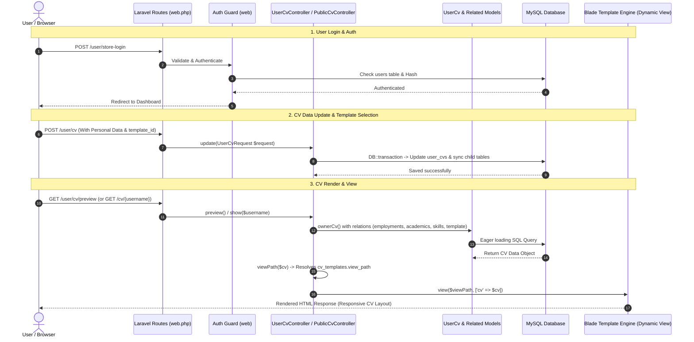

# Technical Documentation: TechSeba CV & Authentication Architecture

এই ডকুমেন্টেশনে TechSeba প্ল্যাটফর্মের **User Login**, **CV Add & Update**, **Template Selection**, এবং **Database - Controller - View (UI) Interaction** কীভাবে কাজ করে তার বিস্তারিত বর্ণনা দেওয়া হয়েছে।

---

## 1. System Overview & Technology Stack

- **Framework:** Laravel (PHP)
- **Database:** MySQL
- **Authentication:** Web Session Guard (`auth:web`) with `User` Model
- **CV Architecture:** Relational DB Model with 1-to-1 (`UserCv`) and 1-to-Many (`CvEmployment`, `CvAcademic`, `CvSkill`, etc.) child relationships.
- **Dynamic Template Engine:** View path dynamic binding stored in `cv_templates` table.

---

## 2. User Authentication & Login Flow (ইউজার লগইন প্রসেস)

### **ক্যান্ট্রোলার ও রুট:**
- **Route:** `GET /user/login` ➔ `[UserLoginController::class, 'custom_login_page']` ([routes/web.php](file:///var/www/html/techseba_main/routes/web.php#L183))
- **Submit Route:** `POST /user/store-login` ➔ `[UserLoginController::class, 'store_login']` ([routes/web.php](file:///var/www/html/techseba_main/routes/web.php#L184))
- **Controller File:** [app/Http/Controllers/Auth/LoginController.php](file:///var/www/html/techseba_main/app/Http/Controllers/Auth/LoginController.php)

### **ধাপসমূহ (Step-by-Step Flow):**
1. **Form View Rendering:** ইউজার `/user/login` এ গেলে `auth.login` ব্লেড ভিউ রেন্ডার হয়।
2. **Credential Validation:**
   - Email ও Password ইনপুট গ্রহণ করা হয়।
   - ReCAPTCHA সক্রিয় থাকলে Captcha Rule যাচাই করা হয়।
3. **Database Check (`users` Table):**
   - [User](file:///var/www/html/techseba_main/app/Models/User.php) মডেল দিয়ে ইউজার খোঁজা হয় (`User::where('email', $request->email)->first()`).
   - ইউজার অ্যাকাউন্ট স্ট্যাটাস (`status == STATUS_ACTIVE`), ব্যান স্ট্যাটাস (`is_banned == BANNED_INACTIVE`), এবং ফ্রিজ স্ট্যাটাস (`feez_status == 1`) চেক করা হয়।
4. **Password Verification & Authentication:**
   - `Hash::check($request->password, $user->password)` দিয়ে পাসওয়ার্ড নিশ্চিত করা হয়।
   - `Auth::guard('web')->attempt($credentials, $request->remember)` দিয়ে ইউজারের সেশন হ্যান্ডেল করা হয়।
5. **Session Migration & Redirect:**
   - গেস্ট সেশনের ডাটা (যেমন শপিং কার্ট) লগইনকৃত ইউজারের আইডি তে ট্রান্সফার করা হয়।
   - লগইন সফল হলে ইউজারকে `/user/dashboard` রুটে পাঠানো হয়।

---

## 3. CV Data Architecture & Add/Edit Flow (সিভি ডাটা সংরক্ষণ ও আপডেট)

### **মডেল ও ডাটাবেজ স্ট্রাকচার (Database Schema):**
- **Main Model:** [UserCv](file:///var/www/html/techseba_main/app/Models/UserCv.php) ➔ Table: `user_cvs`
  - `user_id` (Foreign Key -> `users`)
  - `template_id` (Foreign Key -> `cv_templates`)
  - `portfolio_template_id` (Foreign Key -> `portfolio_templates`)
  - Personal Information (`full_name`, `father_name`, `email`, `mobile`, `present_address`, `photo`, `signature`, ইত্যাদি)
- **Child Models (1-to-Many Relationships):**
  - `employments` ➔ [CvEmployment](file:///var/www/html/techseba_main/app/Models/CvEmployment.php) (অভিজ্ঞতার তালিকা)
  - `academics` ➔ [CvAcademic](file:///var/www/html/techseba_main/app/Models/CvAcademic.php) (শিক্ষাগত যোগ্যতা)
  - `trainings` ➔ [CvTraining](file:///var/www/html/techseba_main/app/Models/CvTraining.php) (প্রশিক্ষণ)
  - `professionalQualifications` ➔ [CvProfessionalQualification](file:///var/www/html/techseba_main/app/Models/CvProfessionalQualification.php)
  - `skills` ➔ [CvSkill](file:///var/www/html/techseba_main/app/Models/CvSkill.php) (দক্ষতা ও লেভেল)
  - `languages` ➔ [CvLanguage](file:///var/www/html/techseba_main/app/Models/CvLanguage.php)
  - `references` ➔ [CvReference](file:///var/www/html/techseba_main/app/Models/CvReference.php)
  - `projects` ➔ [CvProject](file:///var/www/html/techseba_main/app/Models/CvProject.php)

### **কন্ট্রোলার ও ফর্ম রেন্ডারিং:**
- **Edit Route:** `GET /user/cv` ➔ `[UserCvController::class, 'edit']` ([routes/web.php](file:///var/www/html/techseba_main/routes/web.php#L215))
- **Update Route:** `POST /user/cv` ➔ `[UserCvController::class, 'update']` ([routes/web.php](file:///var/www/html/techseba_main/routes/web.php#L216))
- **Controller File:** [app/Http/Controllers/User/UserCvController.php](file:///var/www/html/techseba_main/app/Http/Controllers/User/UserCvController.php)
- **View File:** [resources/views/user/cv/edit.blade.php](file:///var/www/html/techseba_main/resources/views/user/cv/edit.blade.php)

### **ডাটা প্রসেসিং ও সেভ করার কৌশল (`DB::transaction`):**
1. **Form Input Validation:** [UserCvRequest](file:///var/www/html/techseba_main/app/Http/Requests/UserCvRequest.php) এর মাধ্যমে সমস্ত তথ্য ভ্যালিডেট করা হয়।
2. **File Upload Handling:**
   - ছবি (`photo`), স্বাক্ষর (`signature`), এবং সোর্স ফাইল (`source_file`) আপলোড হলে তা `public/uploads/cv/...` ফোল্ডারে সেভ করে ডাটাবেজে ফাইল পাথ রাখা হয়।
3. **Database Transaction Execution:**
   ```php
   DB::transaction(function () use ($request, $validated, $user, &$cv) {
       $cv = UserCv::firstOrNew(['user_id' => $user->id]);
       $cv->fill(Arr::only($validated, $this->mainFields));
       $cv->save();
       
       $this->syncChildren($cv, $validated);
   });
   ```
4. **Child Tables Synchronization (`syncChildren`):**
   - শিশু টেবিলগুলো (যেমন `employments`, `academics`, `skills`) আপডেট করার সময় পুরনো এন্ট্রি ডিলিট করে নতুন ইনপুটগুলো `sort_order` সহ পুনরায় ক্রিয়েট করা হয় (`delete()` ➔ `createMany()`).

---

## 4. CV Template Selection Mechanism (টেমপ্লেট নির্বাচন প্রসেস)

### **ডাটাবেজ টেবিল:** `cv_templates`
- **Model:** [CvTemplate](file:///var/www/html/techseba_main/app/Models/CvTemplate.php)
- **Fields:**
  - `id`: Unique identifier
  - `name`: টেমপ্লেটের নাম (e.g. Modern, Bdjobs Standard, Minimal)
  - `slug`: ইউআরএল ফ্রেন্ডলি নাম
  - `preview_image`: ড্যাশবোর্ডে দেখানোর জন্য ছবি
  - `view_path`: Blade View এর পাথ (e.g. `frontend.cv.templates.modern`)
  - `is_active`: টেমপ্লেটটি সচল আছে কিনা (Boolean)

### **ইউজার দ্বারা টেমপ্লেট সিলেক্ট ও সেভ:**
1. `UserCvController@edit` মেথডে সকল সক্রিয় টেমপ্লেট ফেচ করা হয়:
   `$templates = CvTemplate::where('is_active', true)->orderBy('name')->get();`
2. ইউজারের ফর্ম সাবমিটের মাধ্যমে `template_id` `user_cvs` টেবিলে সেভ হয়।

---

## 5. UI & Database Interaction: How Data is Shown on CV View

### **Dynamic View Resolution (ডাইনামিক ভিউ পাথ নির্ধারণ):**
ইউজার যখন সিভি প্রিভিউ বা ভিউ করতে চায়:
`UserCvController.php` এর `viewPath()` মেথডটি ইউজারের সিলেক্ট করা টেমপ্লেট অনুযায়ী সঠিক Blade Template খুঁজে বের করে:

```php
private function viewPath(UserCv $cv): string
{
    // ইউজারের CV তে যুক্ত টেমপ্লেটের view_path ব্যবহার করা হয়। ডিফোল্ট হিসেবে 'frontend.cv.templates.bdjobs' থাকে।
    $viewPath = $cv->template?->view_path ?: 'frontend.cv.templates.bdjobs';

    return view()->exists($viewPath) ? $viewPath : 'frontend.cv.templates.bdjobs';
}
```

### **প্রিভিউ ও পাবলিক ভিউ রুটসমূহ:**
1. **Owner Preview:** `GET /user/cv/preview` ➔ `UserCvController@preview()`
2. **PDF Download:** `GET /user/cv/pdf` ➔ `UserCvController@pdf()` ( uses `Barryvdh\DomPDF\Facade\Pdf`)
3. **Public CV View:** `GET /cv/{username}` ➔ `PublicCvController@show($username)`

### **UI এ ডাটা দেখানোর উদাহরণ (Blade View Display):**
যেমন `resources/views/frontend/cv/templates/modern.blade.php` এ ডাটাবেজ থেকে ফেচ করা `$cv` অবজেক্টের তথ্য প্রসেস করে রেন্ডার হয়:

- **ব্যক্তিগত তথ্য দেখানো:**
  ```blade
  <h2>{{ $cv->full_name }}</h2>
  <p>Email: {{ $cv->email }} | Phone: {{ $cv->mobile }}</p>
  ```
- **অভিজ্ঞতা (Employments Loop):**
  ```blade
  @foreach($cv->employments as $emp)
      <div class="job-item">
          <h4>{{ $emp->designation }} — {{ $emp->company_name }}</h4>
          <p>{{ $emp->start_date }} - {{ $emp->is_current ? 'Present' : $emp->end_date }}</p>
          <p>{{ $emp->responsibilities }}</p>
      </div>
  @endforeach
  ```
- **দক্ষতা (Skills Loop):**
  ```blade
  @foreach($cv->skills as $skill)
      <span class="badge">{{ $skill->skill_name }} ({{ $skill->skill_level }})</span>
  @endforeach
  ```

---

## 6. Full Data Flow Architecture Diagram



---

## 7. Key Files Directory Reference

| Component | File Path |
| :--- | :--- |
| **Routes** | [routes/web.php](file:///var/www/html/techseba_main/routes/web.php) |
| **Login Controller** | [app/Http/Controllers/Auth/LoginController.php](file:///var/www/html/techseba_main/app/Http/Controllers/Auth/LoginController.php) |
| **CV Controller** | [app/Http/Controllers/User/UserCvController.php](file:///var/www/html/techseba_main/app/Http/Controllers/User/UserCvController.php) |
| **Public CV Controller** | [app/Http/Controllers/PublicCvController.php](file:///var/www/html/techseba_main/app/Http/Controllers/PublicCvController.php) |
| **Main CV Model** | [app/Models/UserCv.php](file:///var/www/html/techseba_main/app/Models/UserCv.php) |
| **Template Model** | [app/Models/CvTemplate.php](file:///var/www/html/techseba_main/app/Models/CvTemplate.php) |
| **CV Edit Blade** | [resources/views/user/cv/edit.blade.php](file:///var/www/html/techseba_main/resources/views/user/cv/edit.blade.php) |
| **CV Templates Directory** | `resources/views/frontend/cv/templates/` |
